## Hello, DNS here!

<picture>
  <source media="(prefers-color-scheme: dark)" srcset="bio-dark.svg">
  
</picture>

[About Me | ThatDNS](https://www.thatdns.dev/about/)

  <!-- <picture>
<source
    srcset="https://github-readme-stats-tan-two-25.vercel.app/api?username=thatdns&show_icons=true&count_private=true&hide=stars&theme=dark"
    media="(prefers-color-scheme: dark)"
  />
  <source
    srcset="https://github-readme-stats-tan-two-25.vercel.app/api?username=thatdns&show_icons=true&count_private=true&hide=stars"
    media="(prefers-color-scheme: light), (prefers-color-scheme: no-preference)"
  />
  
</picture>

 -->

<!--
**ThatDNS/ThatDNS** is a ✨ _special_ ✨ repository because its `README.md` (this file) appears on your GitHub profile.

Here are some ideas to get you started:

- 🔭 I’m currently working on ...
- 🌱 I’m currently learning ...
- 👯 I’m looking to collaborate on ...
- 🤔 I’m looking for help with ...
- 💬 Ask me about ...
- 📫 How to reach me: ...
- 😄 Pronouns: ...
- ⚡ Fun fact: ...
-->
